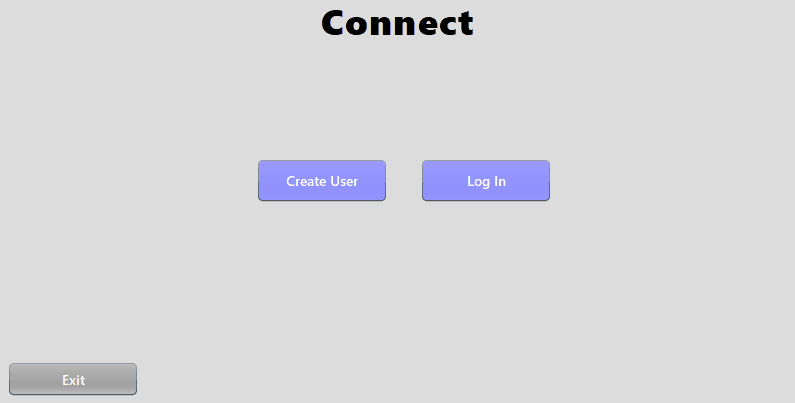
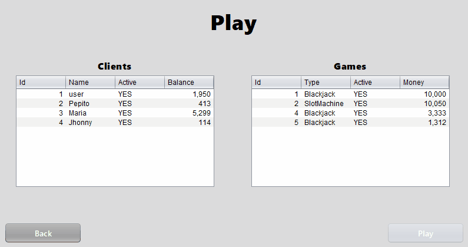
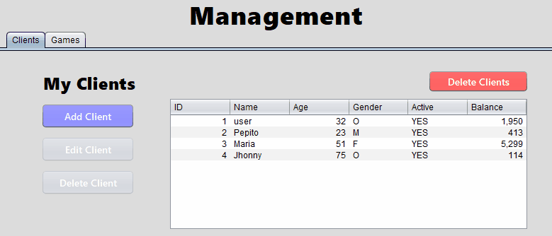
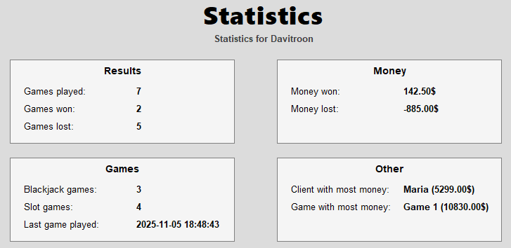

# Virtual Casino

**Virtual Casino** is a Java desktop application that brings the excitement of a casino to your screen.  
Built with **Swing** and **MySQL**, it features an intuitive interface, multiple classic games such as **Blackjack** and **Slot Machines**, and a dynamic money system that updates based on the player's results.  


---

## 📚 Table of Contents
- [🧾 Project Overview](#project-overview "Learn more about the game's concept and purpose")
- [🚀 How to Run](#how-to-run "Instructions to install and run the project locally")
- [🕹️ Using the Application](#using-the-application "Step-by-step guide on how to play or use the game")
- [🏗️ Architecture](#architecture "See the general structure and design of the project")
- [⚙️ Technologies Used](#technologies-used "See which technologies were used to build the project")
- [🔮 Future Additions](#future-additions "See features planned for the future")

## 🧾 Project Overview

This project was developed as part of a **Higher Vocational Training Program in Web Development**.  
Its main objective was to create a fully functional **CRUD system** connected to a **MySQL** database, integrated within a graphical user interface built with **Java Swing**.  

The application simulates a small casino management system where users can **register, log in, manage their data, and play interactive casino games** in a self-contained environment.

---

## 🚀 How to Run
> ⚠️ **Note:** MySQL must be installed on your system before running the application.

You can launch the application either from source or using the prebuilt launcher.

---

### 🧩 Option 1 — Run from Source
1. **Clone the repository:**
   ```bash
   git clone https://github.com/yourusername/virtual-casino.git
   ```
2. **Open or build the project:**
   
   Locate the `Launcher` class under:
   ```bash
   /src/controller/Launcher.java
   ```
4. **Run the application:**
   ```bash
   java -jar VirtualCasino.jar
   ```
   *(or run the `Launcher` class directly from your IDE)*

---

### 🎯 Option 2 — Run via Launcher
1. **Download** the latest release from the [Releases section](https://github.com/Davitroon/VirtualCasino/releases).  
2. **Unzip** the downloaded file.  
3. **Double-click** `VirtualCasino.exe` to start the game.

---

### 🗃️ Database Setup
When you launch the app for the first time:

- You’ll be prompted to enter your **MySQL root password**.
- If the required database doesn’t exist, it will **automatically install** it using the included script.

> ✅ **Tip:** You can modify the database connection settings in:

   ```bash
   /src/dao/DatabaseConnection.java
   ```

---

## 🕹️ Using the Application
Once you launch the application, the first step is to connect with a user account.  
You can either **create a new user** or **log in** with an existing one.



After logging in, you'll enter the **main menu**, where you can access different sections and features.

---

### 🎮 Play

You can play various games using the clients you’ve created.  
Each game affects your balance depending on your results — win to earn more, or lose and watch your funds decrease!

The application currently includes the following games:

---

#### ♠️ Blackjack


Try your luck in **Blackjack**, the classic card game where your goal is to reach 21 without going over.  
You’ll face the dealer in turn-based rounds — make smart choices between *Hit* and *Stand* to maximize your chances.

---

#### 🎰 Slot Machine


Spin the reels in the **Slot Machine** and test your fortune!  
Match symbols to earn credits and watch the balance update dynamically after each spin.

---

### 🧩 Management


The **Management** section allows you to handle all user-related data within the application.  
From here, you can **create, edit, and delete clients and games**.

This area provides a simple and visual **CRUD interface** connected directly to the MySQL database, ensuring that every change is saved and synchronized instantly.

---

### 📊 Statistics


The **Statistics** section provides a detailed overview of your activity within the casino.  
Here you can track your **wins, losses, total games played**, and overall **balance progression** over time.

This feature offers an intuitive and visual way to analyze your performance, helping you keep track of your gameplay history and improvement.


## 🏗️ Architecture

The application follows the **MVC pattern** (Model, View, Controller), containing contains the following packages:

- ### 📦 controller
The package responsible for performing most logical operations and connecting the view to the database.

| Class | Description |
|-------|--------------|
| **DataBaseController** | Manages database operations across different DAOs (`UserDAO`, `ClientDAO`, `GameDAO`, `GameSessionDAO`). |
| **Launcher** | The main entry point of the application. |
| **MainController** | Central controller coordinating between the Model (game logic, clients, users) and the View (UI). |
| **Validator** | Validates input and output data across the application. |
| **ViewController** | Manages user interfaces and handles window or panel transitions. |

---

- ### 📦 dao
The package responsible for sending queries to the database

| Class | Description |
|-------|--------------|
| **ClientDAO** | Manages CRUD operations for `Client` entities. |
| **DataBaseConnector** | Handles the connection between the application and the MySQL database. |
| **DatabaseManager** | Central manager for all database operations within the MVC structure. |
| **GameDAO** | Manages CRUD operations for `Game` entities. |
| **GameSessionDAO** | Handles persistence of game session data. |
| **UserDAO** | Manages CRUD operations for `User` entities. |

---

- ### 📦 model
The package responsible for defining the data received from the database 

| Class | Description |
|-------|--------------|
| **Blackjack** | Represents the Blackjack game (extends `Game`). |
| **Client** | Represents a client (customer) in the casino system. |
| **Game** | Abstract base class representing a casino game. |
| **Session** | Manages user login sessions in the application. |
| **Slotmachine** | Represents the Slot Machine game (extends `Game`). |
| **User** | Represents a user profile in the system. |

---

- ### 📦 ui
The package that provides the user interface for the application

| Class | Description |
|-------|--------------|
| **BlackjackUI** | Panel where the Blackjack game is played. |
| **ClientEditUI** | Panel for editing existing client data. |
| **ClientUI** | Panel for adding new clients to the system. |
| **ConnectUI** | Login or registration panel. |
| **GameEditUI** | Panel for editing existing games. |
| **GameUI** | Panel for adding new games. |
| **HomeUI** | Main menu panel of the casino simulator. |
| **LogInUI** | Login panel for existing users. |
| **MainFrame** | The main frame containing and managing all panels. |
| **ManagementUI** | Panel for managing clients and games. |
| **PlayUI** | Panel for launching games. |
| **ProfileUI** | Displays information about the currently logged-in user. |
| **SignInUI** | Allows creation of a new account. |
| **SlotmachineUI** | Panel where the Slot Machine game is played. |
| **StatsUI** | Displays user-specific game statistics. |

- ### 📦 Exceptions
The package responsible using custom exceptions and hadling them 

| Class | Description |
|--------|-------------|
| **BetException** | Custom exception thrown when a bet cannot be placed due to various reasons. |
| **ExceptionMessage** | Utility class to handle exceptions by displaying a user-friendly error message and logging technical details to the console. |
| **GameException** | Exception thrown when an attempt is made to open the games window without any existing user or game created beforehand. |
| **MailException** | Exception thrown when an entered email is invalid or does not meet the expected format. |

---

## ⚙️ Technologies Used

- **Java 17+**
- **Swing (Javax Swing)** — for building the graphical interface.
- **MySQL** — as the relational database.
- **JDBC** — for database communication.
- **MVC Architecture** — for clean separation of logic, data, and UI.
- **DAO Pattern** — for structured and reusable database access.

---

## 🔮 Future Additions

The project is still under development, and several features are planned for future updates:

- 🎲 **More Games:** Add new casino games to expand the gameplay experience beyond Blackjack and Slot Machines (Russian roulette, Poker, Horse bets...).  
- 📈 **Expanded Statistics:** Include more detailed metrics and visual charts for better player performance tracking.  
- 🧑‍💼 **Admin Panel:** Implement a dedicated administration menu to manage users, balances, and permissions.  
- 🌍 **Multi-language Support:** Introduce translation files to make the application accessible in multiple languages.  
- 🐞 **Debug Mode:** Add an optional developer mode to log events and errors for easier debugging.

